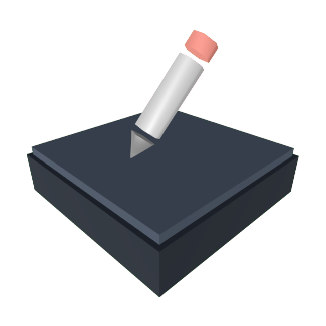

</img>

A simple app that I plan on filling with stuff I personally need, either as a replacement for other apps or just something I don't already have (offline).

# Table of contents
- [About](#about)
- [Sub-apps](#sub-apps)
  - [Notepad](#notepad)
  - [UUID](#uuid)
  - [D-ID](#d-id)
  - [Englueh](#englueh)
- [Planned sub-apps](#planned-sub-apps)
  - [Whiteboard](#whiteboard)
  - [Macro](#macro)
  - [Folder job](#folder-job)
  - [File convert](#file-convert)
  - [File compress](#file-compress)
  - [File encrypt](#file-encypt)
  - [Chatbot](#chatbot)
- [Compile it yourself](#compile-it-yourself)
- [Credits](#credits)

# About
Desktop Utilities is a free open source Godot app for Windows. The app contains sub-apps accessible through the home menu which displays a grid of options. There are plenty of sub-apps available for everyday use

# Sub-apps
## Notepad
Very simple notepad with a markdown preview panel & a font selector. Of course it also has save & load functionality, however your settings are reset when you leave notepad.

## Die now
Process killer for Windows, you can easily modify a list of processes that you can either indivually kill or all at once! You can also export & load as a Bash script so you can run the killer from other programs or without having to open Desktop Utilities.

I created this for the sole purpose of ACTUALLY closing game launchers after I closed the app, because they just love to stay in the background & pile up serving no purpose other than to collect telemetry data & eat up your RAM. I used to have a special little Bash script I manually edit & run anytime I find a program that has stayed beyond it's welcome, but now use this which for me is a lot more convenient.

It would be really nice if I could somehow find a way of automatically killing launchers when I exit their app, but there doesn't seem to be any way of reliabley doing that.

## UUID
UUID-V4 generator frontend. The actual code for generating the UUIDs is credited to https://github.com/binogure-studio/godot-uuid.

## D-ID
Dynamic ID generator that can generate IDs with a maximum of 6 parts. Each part has a character set it can randomly pull from, the character set can be modified to include letters, capitol letters, numbers, symbols, unicode lite, & unicode spectrum characters. You can even add your own characters via the custom includes text box. Each part may also hold a prefix & suffix phrase.

You can save / load your D-ID ruleset as JSON via the "File" menu or by pressing CTRL-S / CTRL-L. Loading an invalid JSON file will (likely) do nothing.

## Englueh
Silly "english" word generator (or close enough anyway), I actually made this back in 2023 as a fun command for a Discord bot lmao.

# Planned sub-apps
## Whiteboard
Tool to draw out diagrams or graphs using simple placeable shapes & nodes.

## Macro
I want this to be a very easy to use node-based macro creation tool.

## Folder job
Run actions on all files in a folder at once, like renaming parts of a file. Might be a little more complex, but we'll see.

## File compress
Compresses files using the built-in compression in Godot

## File encrypt
Encrypts files using the built-in file encryption in Godot.

## Chatbot
#DeathToClankers, ahem... Anyway this will just be a frontend connected OLLAMA (local LLM platform) if you have it installed. You can save & load sessions from files.

I want this to have a focus on actually useful stuff like data organization & analysis so it will include built-in tools that make it much easier to do while attempting to prevent hallucinations by making many small requests.

# Compile it yourself
If you have any experience exporting a Godot game or app, this should be very easy for you. Just load the Desktop Utilities project into Godot then export using your desired export template. Remember to exclude the "EXPORT" & "Other" folders when exporting.

You CAN export to Linux, Mac, iOS, Android, & Web. However this project is not made for any of those platforms & is not guaranteed to work, but to save some trouble here are issues you will encounter using this on other platforms:
## Web limitations
- File saving/loading does not work, meaning you cannot export or load your sessions.
## Linux, Mac, iOS, Android limitations
- Sub-apps that rely on Windows commands will likely crash.

You can always modify the source project to work correctly for your platform, if you have any experience working will Godot.

# Credits
- [MarkdownLabel](https://github.com/daenvil/MarkdownLabel) plugin by Daenvil.
- [ClassicGodot](https://github.com/godotengine/godot) GUI theme by Godot Engine.
